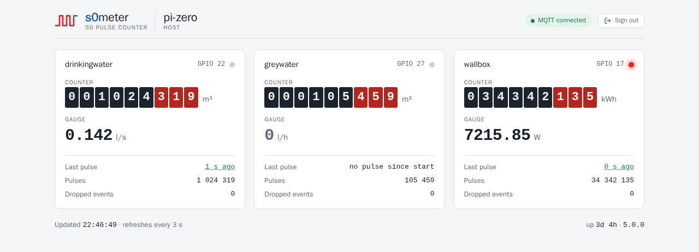
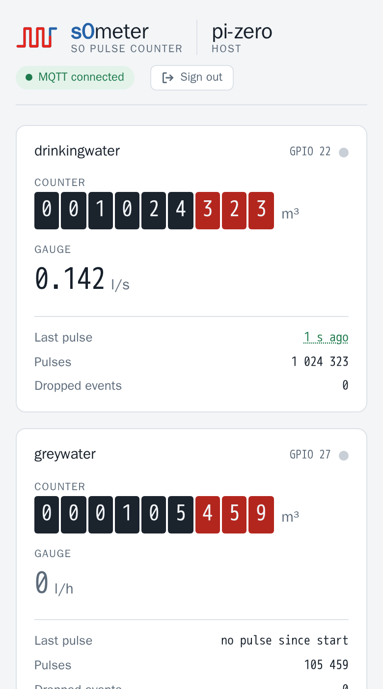
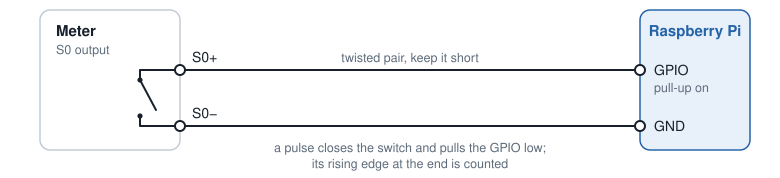
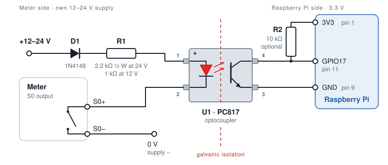

# s0meter

**Count the S0 pulses of electricity, water and gas meters on a Raspberry Pi — and see them live.**

[](https://github.com/womat/s0meter/actions/workflows/ci.yml)
[](https://github.com/womat/s0meter/releases/latest)
[](LICENSE)
[](go.mod)


🇩🇪 [Deutsche Kurzfassung](README.de.md)

<p align="center">
  <picture>
    <source media="(prefers-color-scheme: dark)" srcset="docs/screenshots/web-ui-dark.png">
    
  </picture>
  &nbsp;
  
</p>

> **Got a Pi and a meter with an S0 output?** The [Quick start](#quick-start) gets you from download to
> the live page in about ten minutes.

Almost every electricity meter, and many water and gas meters, has an **S0 pulse output**
(DIN 43864): one short pulse per Wh or litre. Wire it to a GPIO pin of a Raspberry Pi — a Pi Zero
is plenty — and s0meter turns those pulses into meter readings:

- the **total** (`counter`) and the current **power or flow** (`gauge`) of every meter,
- published via **MQTT** on every pulse, ready for Node-RED, Home Assistant, ioBroker or openHAB,
- shown live on a **built-in web page**, with the counter as a meter register and a pulse LED that
  flashes like the one on the meter,
- saved regularly and on every shutdown, so a reboot keeps the reading.

No cloud, no database, no runtime: a single binary, configured with one YAML file.

## Features

- **Live web page** per device: counter register, gauge, last pulse, pulse LED, MQTT state —
  readable on a phone, light and dark mode
- **Display units**: count in Wh or litres, read in kWh or m³ like on the meter
- **MQTT** publishing on every counted pulse (throttled), plus a heartbeat
- **Persistent counters**: saved every `backupInterval` and on shutdown, written atomically so a
  power cut cannot corrupt the file (it costs at most the pulses since the last save)
- **Lost pulses recovered**: pulses the GPIO layer dropped are counted late, not lost
- **HTTPS REST API** with API key, IP allowlist / blocklist
- **Hot reload** of the configuration via `SIGHUP`; a broken file is refused, counting goes on
- Release builds for every Raspberry Pi architecture, from the **Pi Zero (ARMv6)** to 64-bit
  systems; developed and run on a Pi Zero

---

## Quick start

**1. Download** the archive for your Pi from the [latest release](https://github.com/womat/s0meter/releases/latest):

| Archive        | Raspberry Pi model                           |
|----------------|----------------------------------------------|
| `linux_armv6`  | Pi 1 and Zero (1st gen)                      |
| `linux_armv7`  | Pi 2 / 3 / 4 / 5 / Zero 2 W with a 32-bit OS |
| `linux_arm64`  | Pi 3 / 4 / 5 / Zero 2 W with a 64-bit OS     |

```sh
VERSION=5.0.0 ARCH=armv6        # see the release page for the latest version
BASE=https://github.com/womat/s0meter/releases/download/v$VERSION
curl -LO $BASE/s0meter_${VERSION}_linux_$ARCH.tar.gz -LO $BASE/checksums.txt
sha256sum -c checksums.txt --ignore-missing
tar xzf s0meter_${VERSION}_linux_$ARCH.tar.gz
```

**2. Install** binary, example configuration and a certificate:

```sh
sudo groupadd -r -f s0meter
sudo useradd -r -s /usr/sbin/nologin -g s0meter s0meter
sudo usermod -aG gpio s0meter
sudo mkdir -p /opt/s0meter/{bin,etc,data}

sudo install -m 755 s0meter /opt/s0meter/bin/
sudo install -m 640 config/config.yaml /opt/s0meter/etc/
sudo openssl req -x509 -nodes -newkey rsa:2048 -days 825 \
  -keyout /opt/s0meter/etc/key.pem -out /opt/s0meter/etc/cert.pem -subj "/CN=$(hostname)"
sudo chown -R s0meter:s0meter /opt/s0meter
```

**3. Configure** `/opt/s0meter/etc/config.yaml`: set `env: prod`, a random `apiKey`
(`openssl rand -hex 24`), your MQTT broker (or `connection: ""`) and one entry per meter — see
[Configuration](#configuration) and [Wiring](#wiring).

**4. Start** it as a service and open the firewall:

```sh
sudo tee /etc/systemd/system/s0meter.service > /dev/null <<'EOF'
[Unit]
Description=s0meter — S0 Pulse Energy Monitor
After=network-online.target
Wants=network-online.target

[Service]
User=s0meter
Group=s0meter
Type=simple
ExecStart=/opt/s0meter/bin/s0meter
ExecReload=/bin/kill -HUP $MAINPID
Restart=on-failure
RestartSec=5

[Install]
WantedBy=multi-user.target
EOF

sudo systemctl daemon-reload
sudo systemctl enable --now s0meter
sudo ufw allow 8443/tcp          # if ufw is active
journalctl -u s0meter -n 20      # "Module started successfully"
```

**5. Open** `https://<your-pi>:8443/`, accept the self-signed certificate and enter the API key.

Raspberry Pi OS often keeps the journal in RAM only, so the log of a crash is gone after the reboot.
Check with `grep Storage /etc/systemd/journald.conf`; if it says `volatile` or is unset, make it
persistent:

```sh
sudo mkdir -p /etc/systemd/journald.conf.d
printf '[Journal]\nStorage=persistent\n' | sudo tee /etc/systemd/journald.conf.d/persistent.conf
sudo systemctl restart systemd-journald
```

## Wiring

An S0 output is a potential-free switch, usually an optocoupler, with the terminals **S0+** and
**S0−**. Connect **S0+ to a GPIO pin** (BCM numbering, `gpio` in the configuration) and **S0− to
GND**. s0meter enables the Pi's internal pull-up, so the line idles high, each pulse pulls it low,
and the rising edge at the end of the pulse is counted. The reed contacts of water and gas meters
are wired the same way.

<p align="center">
  
</p>

- Never connect S0+ to a voltage: the GPIO pins take **3.3 V at most**.
- DIN 43864 allows the S0 circuit to run at up to 27 V, but most meters switch the Pi's 3.3 V fine.
  If the meter's data sheet asks for a minimum current, add an external pull-up of a few kΩ from the
  GPIO to 3.3 V.
- Long cables pick up noise; a twisted pair and a sensible [debounce time](#choosing-a-debounce-time)
  help.

### With an optocoupler (galvanic isolation)

The direct connection ties the meter's S0 circuit to the Pi's ground. That is fine for a meter next
to the Pi, but an **optocoupler** between them is the safer choice when

- the cable is long or leaves the cabinet, e.g. to a water meter in the basement,
- the meter sits in a distribution board with mains wiring, or another circuit's ground is involved,
- the S0 circuit is to run at its specified voltage (12–24 V) instead of the Pi's 3.3 V.

A **PC817** (also sold as LTV-817 or EL817, same pinout) does the job: cheap, available everywhere
and far faster than S0 needs. The meter switches the optocoupler's LED, powered by its own supply,
and the optocoupler's transistor takes the meter's place on the Pi:

<p align="center">
  
</p>

| Ref | Part | Value | Notes |
|-----|------|-------|-------|
| U1 | Optocoupler | PC817 (LTV-817, EL817) | pin 1 anode, 2 cathode, 3 emitter, 4 collector |
| R1 | Resistor, LED side | 2.2 kΩ ½ W at 24 V · 1 kΩ ¼ W at 12 V | about 10 mA (24 V) or 9 mA (12 V) LED current, within the S0 limit of 27 mA (DIN 43864); at 24 V it dissipates about 0.2 W |
| R2 | Resistor, pull-up | 10 kΩ ¼ W, GPIO to 3V3 | **optional**: s0meter enables the internal pull-up (about 50 kΩ) anyway; R2 gives a firmer level and cleaner edges, worth it on longer cables |
| D1 | Diode | 1N4148, in series with R1, anode to the supply's + | **recommended**: blocks the current of a swapped supply and so protects both the PC817's LED (6 V in reverse at most) and the meter's S0 output, which is polarized and often an optocoupler itself |

`R1 = (supply − 1.2 V LED − 0.7 V D1 − about 1 V across the S0 output) / 10 mA`, rounded to the next standard
value. A pulse switches the transistor on and pulls the GPIO low, exactly like the direct
connection, so the configuration does not change. Any GPIO works; GPIO17 is only the example.
Ready-made S0 input modules with an optocoupler work the same way.

### Maximum pulse rate

Four limits apply; the lowest one counts:

| Limit | Maximum | Notes |
|-------|---------|-------|
| S0 interface (DIN 43864) | about **16 Hz** | pulse at least 30 ms, pause at least 30 ms |
| s0meter's debounce | **1 / (2 × `debounceTime`)** | pulse and pause must each outlast the debounce: 10 ms → 50 Hz, 20 ms → 25 Hz |
| PC817 with 10 kΩ pull-up | a few **kHz** | switching times of a few to some tens of µs; irrelevant for S0 |
| Raspberry Pi, even a Zero | far above any S0 rate | edges are timestamped by the kernel and buffered; a burst that overruns the buffers is counted late, not lost — see `droppedEvents` |

In practice the meter is the limit, and the debounce has to stay below its pulse and pause length.
At 1000 imp/kWh, 22 kW is about 6 pulses per second. A meter with 10 000 imp/kWh, however, reaches
the S0 limit of 16 Hz at only about 5.8 kW; check whether such a meter uses shorter pulses than
S0's 30 ms, and keep the debounce below them. Check the meter's data sheet for its pulse length and maximum frequency, and see
[Choosing a debounce time](#choosing-a-debounce-time).

---

## Web UI

`https://<host>:8443/` opens a diagnostic page with one card per meter: the counter as a meter
register and the gauge, both in the meter's [display units](#display-units), the age of the last
pulse, the raw pulse count, the dropped events and a pulse LED. The LED flashes once per counted
pulse, spread over the 3-second refresh because the page only learns how many pulses were added;
the wave in the logo fires whenever any meter counts. The header names the host and shows the MQTT
state, the footer the time of the last update, the uptime and the version. The browser tab reads
`s0meter · <host>`, so several devices can be told apart.

The page refreshes every 3 seconds while the tab is visible and marks the values as stale when the
device stops answering.

The page itself is public and contains no data. On the first visit it asks for the API key, keeps
it in the browser's local storage and sends it as `X-API-Key` to `/health`; "Sign
out" removes it, and a rejected key brings the prompt back. It is a single file embedded in the
binary, with no external fonts or scripts, so it works without internet access.

---

## Configuration

Default location: `/opt/s0meter/etc/config.yaml`
Environment variables are expanded inside the file in the `${VAR}` form only, e.g.
`apiKey: ${S0METER_API_KEY}`; an unset variable becomes empty. Any other `$` is kept literally, so
keys and passwords may contain it. Unknown keys are rejected, so a misspelled or renamed setting
stops the start instead of silently keeping its default.

```yaml
# =============================================================================
# s0meter configuration
# =============================================================================

# logLevel defines the minimum log level.
# Messages with at least this level are logged.
# Allowed values: debug | info | warn | error
logLevel: info

# logDestination defines where logs are written to.
# Supported values: stdout | stderr | /path/to/logfile
logDestination: stdout

# environment: dev | prod
# With prod, a missing webserver.certFile is an error; dev falls back to the embedded,
# publicly known development certificate.
env: dev


# =============================================================================
# Webserver configuration (HTTPS)
# =============================================================================
webserver:
  # Host address the HTTPS server listens on (0.0.0.0 = all interfaces)
  listenHost: 0.0.0.0

  # Port the HTTPS server listens on
  listenPort: 8443

  # Global API key for protected endpoints
  apiKey: changeme!

  # TLS private key file
  keyFile: /opt/s0meter/etc/key.pem

  # TLS certificate file
  certFile: /opt/s0meter/etc/cert.pem

  # Blocked IP addresses or networks (empty = none blocked)
  # Examples: 192.168.0.1, 192.168.0.0/16, 10.0.0.0/8
  blockedIPs: [ ]
  #  - 192.168.0.1
  #  - 192.168.0.0/16

  # Allowed IP addresses or networks (empty = all allowed)
  # Note: ::1 is the IPv6 loopback address
  # Examples: 127.0.0.1, ::1, 192.168.0.0/16
  allowedIPs: [ ]
  #  - 127.0.0.1
  #  - ::1
  #  - 192.168.0.0/16

# =============================================================================
# Data collection
# =============================================================================

# File where counters are persisted
dataFile: /opt/s0meter/data/s0meter.yaml

# Interval as Go duration string (e.g. 60s) for saving counters to dataFile
backupInterval: 60s

# =============================================================================
# MQTT configuration (disabled when connection is empty)
# =============================================================================
mqtt:
  # Broker connection string (empty = MQTT disabled)
  connection: "tcp://mqtt.example.com:1883"

  # Heartbeat: every meter is published at least this often, as a Go duration string
  publishInterval: 60s

  # How often the publish loop checks for new pulses. A meter is published as soon as a new
  # pulse is counted, but never more than once per minPublishInterval - this throttles a
  # fast pulsing meter. Set to 0 to publish on the heartbeat only.
  minPublishInterval: 2s

# =============================================================================
# S0 Meter configurations
# =============================================================================
# gpio                 - GPIO for the S0 input, BCM numbering 2-27, one meter per GPIO
# debounceTime         - Debounce time as Go duration string (e.g. 1ms) to suppress signal noise
# counterPulsesPerUnit - Meter constant (Zählerkonstante): pulses per counterUnit
#                        (see meter datasheet, e.g. 1000 imp/kWh)
# counterUnit          - Unit of the total counter (e.g. kWh, m³, l)
# counterPrecision     - Decimal places for rounding the counter value
# gaugeUnit            - Unit of the flow rate (e.g. kW, W, l/h, l/s)
# gaugeScale           - Amount per pulse in gaugeUnit per hour; the gauge is pulses per hour
#                        times gaugeScale and ignores counterPulsesPerUnit.
#                        1 pulse = 1 Wh: W 1, kW 0.001 - 1 pulse = 1 l: l/h 1, l/s 0.000277778
# gaugePrecision       - Decimal places for rounding the gauge value
# mqttTopic            - MQTT topic to publish meter data (empty = disabled)
# mqttRetained         - Broker keeps the last message of this topic (default: false)
# displayUnit          - Unit the web UI shows the counter in (empty = counterUnit), e.g. Wh -> kWh,
#                        l -> m³. Display only, MQTT and the API keep counterUnit.
#                        Known units: Wh kWh MWh | l m³ m3 | s min h
# displayGaugeUnit     - Unit the web UI shows the gauge in (empty = gaugeUnit).
#                        Known units: W kW MW | l/s l/min l/h m³/h m3/h
# =============================================================================
meter:
  wallbox:
    gpio: 17
    debounceTime: 1ms
    counterUnit: "Wh"
    counterPulsesPerUnit: 1
    counterPrecision: 0
    gaugeUnit: "kW"
    gaugeScale: 0.001
    gaugePrecision: 2
    mqttTopic: test/wallbox/summary
    mqttRetained: true
    displayUnit: "kWh"

  greywater:
    gpio: 27
    debounceTime: 1ms
    counterUnit: "l"
    counterPulsesPerUnit: 1
    counterPrecision: 0
    gaugeUnit: "l/h"
    gaugeScale: 1
    gaugePrecision: 0
    mqttTopic: test/rawwater/summary
    displayUnit: "m³"

  drinkingwater:
    gpio: 22
    debounceTime: 1ms
    counterUnit: "m³"
    counterPulsesPerUnit: 1000
    counterPrecision: 3
    gaugeUnit: "l/s"
    gaugeScale: 0.000277778
    gaugePrecision: 3
    mqttTopic: test/portablewater/summary
```

### Meter Configuration Reference

| Field                  | Type   | Description                                                                      |
|------------------------|--------|----------------------------------------------------------------------------------|
| `gpio`                 | int    | GPIO for the S0 input, BCM numbering, 2–27 (GPIO0/1 are reserved for HAT boards); one meter per GPIO |
| `debounceTime`         | string | Debounce as Go duration string — see [Choosing a debounce time](#choosing-a-debounce-time) |
| `counterUnit`          | string | Unit of the total counter (e.g. `kWh`, `m³`, `l`)                                |
| `gaugeUnit`            | string | Unit of the flow rate (e.g. `kW`, `l/h`, `l/s`)                                  |
| `counterPulsesPerUnit` | float  | Meter constant (Zählerkonstante): pulses per counterUnit                         |
| `gaugeScale`           | float  | Amount per pulse in the gauge unit per hour — see [Choosing gaugeScale](#choosing-gaugescale) |
| `counterPrecision`     | int    | Number of decimal places for the counter value (0–15)                            |
| `gaugePrecision`       | int    | Number of decimal places for the gauge value (0–15)                              |
| `mqttTopic`            | string | MQTT topic to publish to (empty = not published)                                 |
| `mqttRetained`         | bool   | Broker keeps the last message of this topic (default: `false`)                   |
| `displayUnit`          | string | Unit the web UI shows the counter in (empty = `counterUnit`) — see [Display units](#display-units) |
| `displayGaugeUnit`     | string | Unit the web UI shows the gauge in (empty = `gaugeUnit`)                         |

### Display units

A meter counts in the unit its pulses come in, and the telegram (MQTT, `/meters`) keeps that unit.
The web UI can show it in another one, the way the physical meter reads: a 1-pulse-per-Wh meter in
kWh, a 1-pulse-per-litre water meter in m³, with the litres as decimal places.

```yaml
  wallbox:
    counterUnit: "Wh"
    gaugeUnit: "W"
    displayUnit: "kWh"
    displayGaugeUnit: "kW"
```

The decimal places follow the unit, so the resolution stays the same: Wh with 0 places is shown as
kWh with 3, W with 2 as kW with 5. A conversion works only between units of one row below, and
`counterUnit`/`gaugeUnit` must be in that row as well; anything else (`Wh` to `m³`, an unknown
unit, a different spelling such as `kwh`) stops the start with a configuration error.

| Quantity | Counter units (`displayUnit`) | Gauge units (`displayGaugeUnit`) |
|----------|-------------------------------|----------------------------------|
| Energy / power | `Wh`, `kWh`, `MWh`      | `W`, `kW`, `MW`                  |
| Volume / flow  | `l`, `m³` (or `m3`)     | `l/s`, `l/min`, `l/h`, `m³/h` (or `m3/h`) |
| Time           | `s`, `min`, `h`         | —                                |

Time is for devices that emit a pulse per run time, such as an operating hours output: 1 pulse per
minute is `counterUnit: min`, shown as `displayUnit: h`.

### Choosing gaugeScale

The gauge is computed from the time between the last two pulses:

```
gauge = 3600 / seconds_between_pulses × gaugeScale    (= pulses per hour × gaugeScale)
```

`counterPulsesPerUnit` plays **no** part in it. `gaugeScale` is therefore the amount one pulse stands
for, expressed in the gauge unit per hour:

| One pulse is | `gaugeUnit` | `gaugeScale`  |
|--------------|-------------|---------------|
| 1 Wh         | `W`         | `1`           |
| 1 Wh         | `kW`        | `0.001`       |
| 1 l          | `l/h`       | `1`           |
| 1 l          | `l/min`     | `0.0166667`   |
| 1 l          | `l/s`       | `0.000277778` |
| 1 m³         | `l/s`       | `0.2777778`   |

So 1000 imp/kWh and 1 imp/Wh both mean one pulse per Wh, and 1000 imp/m³ means one pulse per litre.

How the gauge behaves over time:

- **Ramp-up:** it needs two pulses. The first pulse after a pause measures the whole pause and shows
  close to 0; the real value appears with the second.
- **After the load stops:** the interval is stretched to the time since the last pulse, so the value
  decays toward 0 (`3600 / seconds_since_last_pulse × gaugeScale`) without quite reaching it. It is an
  upper bound: the rate cannot have been higher, or another pulse would have arrived.
- **After a restart:** only the pulse count is restored, not the timestamps. The gauge starts at 0 and
  shows a value again from the second pulse — a restored timestamp could lie ahead of a clock that has
  no RTC and is not yet synchronised, and would produce a spike.

### Choosing a debounce time

`debounceTime` is handed to the kernel's GPIO debouncer: an edge is reported only after the line has
been stable for the full period. **The value must therefore be shorter than the pulse itself** — a
debounce longer than the pulse swallows it entirely and the meter under-counts.

| Meter type                        | Output                     | Bounce behaviour                       | Suggested |
|-----------------------------------|----------------------------|----------------------------------------|-----------|
| Electricity, S0 per DIN 43864     | opto-coupler, electronic   | does not bounce; noise is picked up on the cable | `10ms`    |
| Water / gas with a pulse output   | reed switch, mechanical    | bounces 0.5–2 ms, more at low flow     | `20ms`    |

DIN 43864 specifies a minimum pulse duration of **30 ms**, so up to roughly 10 ms is safe for an S0
meter — do not approach 30 ms. A reed switch bounces mechanically, and `1ms` sits inside that bounce
window: the bounces are then counted as extra pulses.

Pulse spacing is rarely the limit. At 1000 imp/kWh an 11 kW load still leaves 327 ms between pulses
(164 ms at 22 kW), and a water meter at 1000 imp/m³ leaves over 700 ms even at 5 m³/h.

> `pkg/pulsecounter` watches the rising edge only, so the pulse *width* cannot be measured from the
> logs. Take it from the meter's data sheet and stay well below it.

Compare the counter against the physical meter after a few weeks: a value that runs ahead points to
bouncing (increase the debounce), one that falls behind points to a debounce longer than the pulse,
or to a wiring fault.

### Correcting a counter

`dataFile` stores **pulses**, not the scaled reading:

```
pulses = counter × counterPulsesPerUnit
```

The running process rewrites that file every `backupInterval` and again on shutdown, so it has to be
stopped before editing — otherwise the change is overwritten:

```sh
sudo systemctl stop s0meter
sudo nano /opt/s0meter/data/s0meter.yaml    # adjust "pulses:"
sudo systemctl start s0meter
```

Only `pulses:` is read back; the two timestamps in the file are informational. The file is replaced
atomically (temporary file, sync, rename), so a power cut leaves either the previous or the new
version. If it is nevertheless empty or not valid YAML, the service refuses to start with
`Failed to load meter data` rather than silently counting from 0 — restore the file, or delete it to
start every meter from 0 on purpose. A missing file is fine: all meters start from 0 and the file is
created right away.

Two worked examples:

| Physical reading | `counterUnit` | `counterPulsesPerUnit` | `pulses:` |
|------------------|---------------|------------------------|-----------|
| 34270.83 kWh     | `Wh`          | 1                      | 34270830  |
| 105.459 m³       | `m³`          | 1000                   | 105459    |

---

## MQTT Publishing

### Telegram

Each meter is published as one JSON telegram on its `mqttTopic`; `/meters` and `/meters/{name}`
return the same object:

```
myhome/wallbox/summary  {"meter":"wallbox","timestamp":"2026-10-04T22:50:35+02:00","counter":34341804,"counterUnit":"Wh","gauge":3.11,"gaugeUnit":"W"}
```

| Key           | Content                                                                              |
|---------------|--------------------------------------------------------------------------------------|
| `meter`       | Meter name from the configuration, so a telegram is identifiable without its topic    |
| `timestamp`   | Time of the reading, RFC 3339 in local time with offset, whole seconds. For an S0 meter this is also the measuring time: every pulse is counted the moment it arrives |
| `counter`     | Total, in `counterUnit`, rounded to `counterPrecision`                               |
| `counterUnit` | Unit of `counter` from the configuration                                             |
| `gauge`       | Flow rate, in `gaugeUnit`, rounded to `gaugePrecision` — see [Choosing gaugeScale](#choosing-gaugescale) |
| `gaugeUnit`   | Unit of `gauge` from the configuration                                               |

The keys follow the telegrams of ecoflowd: camelCase, `timestamp` as one word, the device named in
every telegram. The units travel with the values because they are configured per meter.

> **Changed in 4.8.0:** `timeStamp` is now `timestamp`, in whole seconds instead of
> nanoseconds, and `meter` is new. Consumers that read `timeStamp` have to be adapted.

### When a meter is published

A meter is published **as soon as a new pulse has been counted** — even when the pulse does not
change the counter at its `counterPrecision` — and in any case once per `publishInterval` (the
heartbeat). Between two pulses only the gauge decays, and that alone does not trigger a message.
A meter with an empty `mqttTopic` is not published at all.

`minPublishInterval` is how often the loop looks for new pulses. It is therefore both the worst-case
delay of a pulse and the shortest spacing between two messages of the same meter, which is what keeps
a fast meter from flooding the broker: a wallbox charging at 11 kW with one pulse per Wh produces
about three pulses per second, which `minPublishInterval: 2s` caps at 30 messages per minute. Set it
to `0` to publish on the heartbeat only.

While the broker connection is down, publishing is skipped instead of blocking on the publish
timeout, and resumes automatically once the client reconnects.

> When pulses stop, the last published gauge stands until the next heartbeat. A long
> `publishInterval` therefore delays the "flow stopped" signal by up to that interval — lower it if
> consumers need to see a stop quickly.

---

## REST API

| Method | Path             | Auth    | Description                               |
|--------|------------------|---------|-------------------------------------------|
| GET    | `/`              | —       | Diagnostic web page, see [Web UI](#web-ui) |
| GET    | `/version`       | —       | Application name and version              |
| GET    | `/ready`         | —       | Readiness probe: 200, or 503 while the configured MQTT broker is not connected |
| GET    | `/health`        | API Key | Runtime metrics, MQTT state, diagnostics per meter |
| GET    | `/meters`        | API Key | Current reading of all meters             |
| GET    | `/meters/{name}` | API Key | Current reading of a single meter         |

Authentication via the `X-API-Key` header. Errors are returned as `{"error": "..."}` with the HTTP status
(401, 404 for an unknown meter, 503 from `/ready`).

### Examples

```sh
# List meters
curl -k -H "X-Api-Key: your-api-key" https://localhost:8443/meters

# Get meter data
curl -k -H "X-Api-Key: your-api-key" https://localhost:8443/meters/{name}

# Application version (no auth required)
curl -k https://localhost:8443/version

# Health check
curl -k -H "X-Api-Key: your-api-key" https://localhost:8443/health
```

`/health` reports, besides the runtime metrics, the MQTT connection as `mqtt` (`connected`,
`disconnected` - also while reconnecting - or `disabled` without a broker) and per meter:

```json
"meters": {
  "wallbox": {
    "gpio": 17,
    "pulses": 34341881,
    "lastPulse": "2026-10-06T14:32:05+02:00",
    "lastPulseAgeSeconds": 2.4,
    "droppedEvents": 0,
    "display": {
      "counter": 34341.881,
      "counterUnit": "kWh",
      "counterPrecision": 3,
      "gauge": 3.6,
      "gaugeUnit": "kW",
      "gaugePrecision": 5
    }
  }
}
```

`lastPulse` and `lastPulseAgeSeconds` are `null` until the first pulse after a start or reload,
because only the pulse count is restored from the data file. The age is computed on the device, so
it stays right even when the clock of the client differs from that of a Pi without RTC. `display`
is the reading in the meter's [display units](#display-units), as the web UI shows it.

> **Changed in 5.0.0:** `droppedEvents` moved from the top level of `/health` into
> `meters.<name>.droppedEvents`; `mqtt` and `meters` are new. Monitoring that reads
> `droppedEvents` has to be adapted. The telegram (MQTT, `/meters`) is unchanged.

---

## Command-line Flags

| Flag        | Default                        | Description                                                         |
|-------------|--------------------------------|---------------------------------------------------------------------|
| `--config`  | `/opt/s0meter/etc/config.yaml` | Path to the configuration file                                      |
| `--debug`   | `false`                        | Enable debug logging to stdout (overrides log settings from config) |
| `--version` | `false`                        | Print the application version and exit                              |
| `--about`   | `false`                        | Print application details and exit                                  |
| `--help`    | `false`                        | Print this help message and exit                                    |

The config file path can also be set via the environment variable `CONFIG_FILE`.

**Examples:**

```bash
s0meter --config /etc/s0meter/config.yaml
s0meter --debug
s0meter --version
CONFIG_FILE=/etc/s0meter/config.yaml s0meter
```

---

## TLS Certificate

> **Warning — always configure a real certificate.** With `env: prod` a missing `certFile` stops
> the start. With `env: dev` the server instead falls back to a self-signed certificate compiled
> into the binary and only logs a warning. That
> certificate's private key ships inside every published release archive, so it is public knowledge:
> anyone can extract it and impersonate an instance running on the fallback. It exists solely so a
> fresh checkout starts up during development. A machine reachable by anyone but you must never run
> on it.

Generate a self-signed certificate for development:

```sh
openssl req -x509 -nodes -newkey rsa:2048 \
  -keyout /opt/s0meter/etc/key.pem \
  -out /opt/s0meter/etc/cert.pem \
  -days 825 \
  -subj "/C=AT/ST=Vienna/L=Vienna/O=MyCompany/OU=DEV/CN=localhost"
```

**Subject fields:**

| Field           | Example             | Description                                  |
|-----------------|---------------------|----------------------------------------------|
| `/C`            | `AT`                | Country code (2 letters)                     |
| `/ST`           | `Vienna`            | State or province (optional)                 |
| `/L`            | `Vienna`            | City (optional)                              |
| `/O`            | `MyCompany`         | Organization (optional)                      |
| `/OU`           | `DEV`               | Organizational unit (optional)               |
| `/CN`           | `localhost`         | **Common Name — your domain or `localhost`** |
| `/emailAddress` | `admin@example.com` | E-mail address (optional)                    |

> **Note:** Browsers enforce a maximum certificate validity of 825 days. Use `-days 365` for production-like setups.

---

## Hot-Reload

Send `SIGHUP` to reload the configuration without restarting the process. The GPIO lines are closed
and re-registered, so a changed `debounceTime` takes effect; counters are saved beforehand and
restored afterwards.

The new configuration is loaded and validated **before** anything is torn down. If it fails, the
reload is refused with `Config reload rejected, keeping the running configuration` in the log and the
service keeps counting with its current settings - fix the file and reload again. Warnings such as a
short `apiKey` are logged after every start and reload.

```sh
sudo systemctl reload s0meter          # requires ExecReload in the unit, see Quick start
# or, independent of the unit file:
sudo systemctl kill -s HUP s0meter
```

---

## Troubleshooting

**`Failed to publish MQTT message ... error="publish timeout"`**
The client was not connected at that moment. `Publish()` waits up to 5 s for the broker and then
reports this. The publish loop skips its tick while disconnected, so this should be rare; repeated
occurrences mean the broker is unreachable rather than slow. Check with
`ss -tn | grep 1883` whether a connection is established at all, and note which address it uses -
a host name resolving to several addresses can send the client to the wrong one.

**Counter does not advance, `gauge` is 0, but the service is healthy**
No pulses are reaching the GPIO pin. This is wiring or the meter itself, not the software: the
service keeps publishing the last known value on the heartbeat. `--debug` logs every counted pulse,
so a run without `s0 pulse` entries confirms the input is silent. On the [Web UI](#web-ui) the
meter's pulse LED then stays grey and "last pulse" keeps growing (or reads "no pulse since start").

**Counter drifts away from the physical meter**
Running ahead points to a debounce that is too short for a bouncing contact, running behind to one
longer than the pulse - see [Choosing a debounce time](#choosing-a-debounce-time). Correct the value
as described under [Correcting a counter](#correcting-a-counter).

`droppedEvents` in `/health` (per meter, also shown on the [Web UI](#web-ui)) and `s0 pulses lost`
in the log are not a cause of drift. They count pulses the GPIO layer lost - because pulse processing fell behind and its 32-event buffer per meter
was full, or because the kernel's own event buffer overflowed. The next pulse that gets through
reports how many were lost before it, and they are added to the counter then, so the counter stays
right; only the gauge skips that interval and restarts with the following pulse. A pulse lost right
before a stop or reload, with no pulse after it, is not recovered. The count starts at 0 with every
start or reload, and anything above 0 means the device is struggling to keep up.

**Service is `dead` immediately after start**
A configuration error; the process exits with code 1 before the logger is even in place, so the
reason is printed on stdout: `Failed to load config file` (YAML could not be parsed - durations such
as `backupInterval` must be Go duration strings like `60s`, not plain numbers; `field … not found`
names a key that does not exist, often a misspelled or renamed one) or `config validation failed`,
for example for a `displayUnit` that cannot be converted. Once the logger is up, `Failed to load
meter data` in the log means the `dataFile` is empty or damaged — see [Correcting a counter](#correcting-a-counter).

---

## Backup & Restore

```sh
# Backup
sudo tar czf /tmp/s0meter-backup.tar.gz /opt/s0meter

# Restore
sudo tar xzf /tmp/s0meter-backup.tar.gz -C /
sudo chown -R s0meter:s0meter /opt/s0meter
sudo systemctl restart s0meter
```

---

## Releases

Every release on the [releases page](https://github.com/womat/s0meter/releases) carries archives for
all Raspberry Pi architectures with the binary, `config/config.yaml`, `README.md` and `LICENSE`,
plus a `checksums.txt` and a changelog. Versions follow [semantic versioning](https://semver.org/);
a breaking change of the API, the telegram or the configuration raises the major version.

`s0meter --version` reports the release a binary was built from. A local build reports something
like `5.0.0-3-g0c13781-dirty` instead, which is how the two are told apart on a device.

Building from source needs Go and `make`: clone the repository and run `make help` for the targets.

---

## License

s0meter is released under the MIT License - see [`LICENSE`](LICENSE) for the full text.

### Third-party licenses

The source tree contains no third-party code, but a **compiled binary statically links** the
modules below. Their terms apply to anyone distributing that binary, not to the sources here.

| Module                                   | License                        |
|------------------------------------------|--------------------------------|
| `github.com/eclipse/paho.mqtt.golang`    | **EPL-2.0**, dual with EDL-1.0 |
| `github.com/warthog618/go-gpiocdev`      | MIT                            |
| `github.com/womat/golib`                 | MIT                            |
| `github.com/swaggo/swag`, `http-swagger` | MIT                            |
| `github.com/golang-jwt/jwt/v5`           | MIT                            |
| `gopkg.in/yaml.v3`                       | MIT                            |
| `github.com/gorilla/websocket`           | BSD-3-Clause                   |

All of these are permissive except the Eclipse Paho MQTT client, which is weak copyleft at file
level: if you hand out a built binary, the source of the EPL-covered parts has to remain available
(it is, at <https://github.com/eclipse-paho/paho.mqtt.golang>). Paho is dual-licensed, so the
BSD-style EDL-1.0 may be chosen instead. Neither obliges s0meter itself to change its license.
